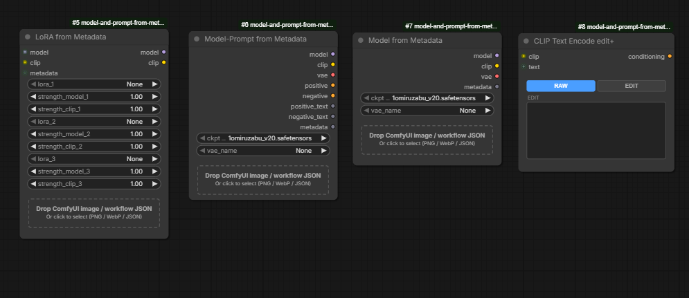
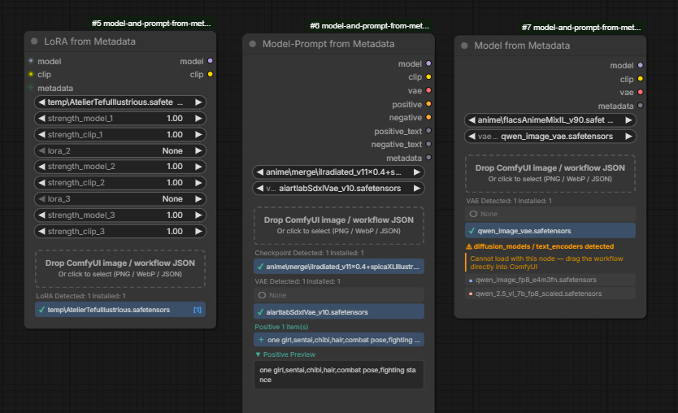

# Model and Prompt from Metadata

**言語:** [English](README.md) | [中文](README.zh.md)

---

**SD1.5 / SDXL / Illustrious** モデルを使った生成画像のメタデータを素早く再利用し、作業全体を加速させることを目的とした ComfyUI カスタムノードです。

PNG / WebP 画像またはワークフロー JSON をノードにドロップするだけで、埋め込まれたメタデータからチェックポイント・VAE・プロンプトを抽出してノードに反映します。過去に生成した画像の設定を即座に再現でき、試行錯誤のサイクルを短縮します。

ComfyUI 生成画像のほか、**Stable Diffusion WebUI / SD Forge neo / Fooocus** で生成した画像、および **ComfyUI-Custom-Scripts の Workflow Image** にも対応しています。

### 対象外モデルについて

**Flux・QWEN・zImage** 等の UNet 系モデルは対象外です。これらのモデルは構成が異なり、チェックポイント単体の入れ替えで画風を管理するスタイルと相性が悪いため、本ノードを使っても効率は上がりません。これらのモデルを含むファイルをドロップした場合は、モデル名を表示した上でワークフロー JSON を ComfyUI に直接ドラッグするよう促すメッセージが表示されます。

> **UI 言語:** ブラウザの言語設定に応じて自動的に日本語 / 英語 / 中国語に切り替わります。

---

## スクリーンショット



*4つのノード: LoRA from Metadata、Model-Prompt from Metadata、Model from Metadata、CLIP Text Encode edit+。*



*左: LoRA from Metadata — LoRA が検出されスロット 1 に自動割り当て。中央: Model-Prompt from Metadata — チェックポイント・VAE・プロンプトが自動選択。右: Model from Metadata — UNet 系モデル（Flux）が検出され、ワークフローを直接使うよう案内。*

---

## ノード一覧

### Model from Metadata (`ImageMetadataCheckpointLoader`)

**カテゴリ:** `loaders`

PNG / WebP / JSON をドロップしてチェックポイントと VAE を読み込むノードです。

**出力**

| 名前 | 型 | 説明 |
|---|---|---|
| model | MODEL | 読み込んだモデル |
| clip | CLIP | CLIP |
| vae | VAE | VAE（「None」選択時はチェックポイント内蔵 VAE）|

---

### Model-Prompt from Metadata (`ImageMetadataPromptLoader`)

**カテゴリ:** `loaders`

チェックポイント・VAE に加えてポジティブ／ネガティブプロンプトも抽出・エンコードするノードです。PNG / WebP / JSON に対応。

**出力**

| 名前 | 型 | 説明 |
|---|---|---|
| model | MODEL | 読み込んだモデル |
| clip | CLIP | CLIP |
| vae | VAE | VAE |
| positive | CONDITIONING | ポジティブ条件付け |
| negative | CONDITIONING | ネガティブ条件付け |
| positive_text | STRING | ポジティブプロンプト（生テキスト）|
| negative_text | STRING | ネガティブプロンプト（生テキスト）|

---

### LoRA from Metadata (`ImageMetadataLoRALoader`)

**カテゴリ:** `loaders`

最大 3 スロットの LoRA を順番に適用するノードです。PNG / WebP / JSON をドロップするとメタデータから LoRA を自動検出・割り当てます。

**入力**

| 名前 | 型 | 説明 |
|---|---|---|
| model | MODEL | モデル |
| clip | CLIP | CLIP |
| metadata | METADATA | （任意）上流ノードからのメタデータ |

**出力**

| 名前 | 型 | 説明 |
|---|---|---|
| model | MODEL | LoRA 適用後モデル |
| clip | CLIP | LoRA 適用後 CLIP |

---

### CLIP Text Encode edit+ (`CLIPTextEncodeEditPlus`)

**カテゴリ:** `conditioning`

受け取ったプロンプトをそのまま使うか（RAW）、手動で編集したテキストを使うか（EDIT）を切り替えられる CLIP エンコーダーです。ポジティブ用・ネガティブ用に 2 つ配置して使います。

- **EDIT テキストエリア**: 初回接続時に受け取ったテキストがコピーされ、自由に編集できます
- **RAW / EDIT ボタン**: どちらのテキストを CONDITIONING として出力するかを切り替え

**入力**

| 名前 | 型 | 説明 |
|---|---|---|
| clip | CLIP | CLIP |
| text | STRING | エンコードするプロンプト（他ノードの STRING 出力を接続）|

**出力**

| 名前 | 型 | 説明 |
|---|---|---|
| conditioning | CONDITIONING | エンコード済み条件付け（RAW または EDIT のテキストを使用）|

---

## 使い方

### Model-Prompt from Metadata / Model from Metadata

1. PNG / WebP 画像またはワークフロー JSON をノード上のドロップゾーンにドラッグ＆ドロップ（またはクリックしてファイル選択）。
2. メタデータが解析され、検出されたチェックポイント・VAE・プロンプトの一覧が表示されます。
3. 一覧からアイテムをクリックして選択。インストール済みのモデルには ✓、未インストールには ✗ が表示されます。
4. **チェックポイントが 1 件かつインストール済みの場合は自動選択**されます。
5. **VAE が 1 件インストール済みの場合も自動選択**されます。ワークフローに VAELoader がない場合は「None」が自動選択されます。手動で変更する場合はリストから選択してください。
6. **プロンプトが 1 件の場合は自動選択**されます。複数件の場合はクリックで選択し、下部のプレビューで全文を確認できます。

### CLIP Text Encode edit+

1. `Model-Prompt from Metadata` の `positive_text` / `negative_text` 出力をそれぞれのノードの `text` 入力に接続します。
2. 接続時に EDIT テキストエリアに同じ内容がコピーされます。
3. テキストエリアを編集してプロンプトを調整し、RAW / EDIT ボタンでどちらを出力するか選択します。

### UNet 系モデルのファイルをドロップした場合

[対象外モデルについて](#対象外モデルについて)の説明の通り、UNETLoader + CLIPLoader 構成のワークフローや SD Forge neo の Flux / UNet 構成画像をドロップすると、モデルファイル名を表示した上でワークフロー JSON を ComfyUI に直接ドラッグするよう促すメッセージが表示されます。

---

## 対応ファイル形式

| ソース | 形式 | 備考 |
|---|---|---|
| ComfyUI | PNG（`prompt` チャンク）| API 形式・LiteGraph 形式どちらも対応 |
| ComfyUI | WebP（EXIF `workflow:` / `prompt:` エントリ）| EXIF チャンクから LiteGraph 形式または API 形式を抽出 |
| ComfyUI | JSON ワークフロー | API 形式・LiteGraph 形式どちらも対応 |
| ComfyUI | このノードを含むワークフロー JSON / PNG | 保存済みの選択値（ckpt・VAE・プロンプト）を復元 |
| ComfyUI-Custom-Scripts | Workflow Image PNG | IEND 後の `workflow` チャンクから LiteGraph 形式を抽出 |
| Workflow Studio | JSON ワークフロー / PNG | `WFS_PromptText` プロンプトプリセットノードのプロンプトを抽出 |
| SD WebUI / SD Forge neo | PNG（`parameters` チャンク）| Checkpoint 構成・UNet 構成どちらも対応 |
| Fooocus | PNG（`parameters` JSON チャンク）| `base_model` / `vae` / プロンプトを抽出 |

### 対応カスタムノード

| ノード | 説明 |
|---|---|
| SDXLPromptStyler / SDXLPromptStylerAll | プロンプトを自動抽出 |
| Lora Loader (LoraManager) | LoRA を自動検出・割り当て（`active: false` の無効エントリを除外）|

---

## インストール

```
ComfyUI/
└── custom_nodes/
    └── model-and-prompt-from-metadata/   ← このリポジトリをここに配置
        ├── __init__.py
        ├── metadata_checkpoint_node.py
        └── js/
            ├── i18n.js
            ├── metadata_checkpoint.js
            ├── metadata_prompt.js
            ├── metadata_lora.js
            ├── clip_text_encode_edit_plus.js
            └── workflow_utils.js
```

ComfyUI を再起動すると自動的に読み込まれます。

---

## ファイル構成

```
model-and-prompt-from-metadata/
├── __init__.py                        # エントリポイント・WEB_DIRECTORY 設定
├── metadata_checkpoint_node.py        # Python ノード定義（4クラス）
└── js/
    ├── i18n.js                        # 多言語対応（en / zh / ja 自動検出）
    ├── workflow_utils.js              # PNG 解析・メタデータ抽出ユーティリティ
    ├── metadata_checkpoint.js         # CheckpointLoader UI 拡張
    ├── metadata_prompt.js             # PromptLoader UI 拡張
    ├── metadata_lora.js               # LoRALoader UI 拡張
    └── clip_text_encode_edit_plus.js  # CLIP Text Encode edit+ UI
```
