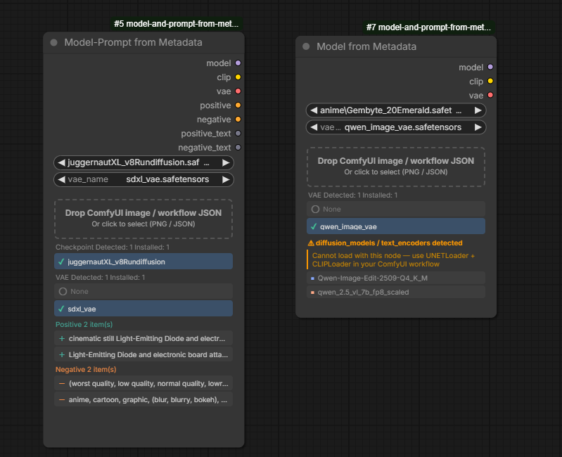

# Model and Prompt from Metadata

**Language:** [日本語](README.ja.md) | [中文](README.zh.md)

---

A ComfyUI custom node designed to quickly reuse metadata from images generated with **SD1.5 / SDXL / Illustrious** models, accelerating your overall workflow.

Simply drop a PNG image or workflow JSON onto the node to extract the checkpoint, VAE, and prompts from the embedded metadata and apply them automatically. Instantly reproduce past generation settings and shorten your trial-and-error cycle.

Also supports images generated with **Stable Diffusion WebUI / SD Forge neo / Fooocus**, and **ComfyUI-Custom-Scripts Workflow Images**.

### Out-of-Scope Models

UNet-based models such as **Flux, QWEN, and zImage** are out of scope. These models have a different architecture and are not suited for the workflow style of managing aesthetics by swapping a single checkpoint, so using this node with them would not improve efficiency. If you drop a file containing these models, a message will be shown displaying the model name and prompting you to drag the workflow JSON directly into ComfyUI.

> **UI language:** Automatically switches between English / Japanese / Chinese based on your browser's language settings.

---

## Screenshot



*Left: Model-Prompt from Metadata — checkpoint, VAE, and prompts detected and auto-selected. Right: Model from Metadata — UNet-based model (QWEN) detected, prompting use of the workflow directly.*

---

## Nodes

### Model from Metadata (`ImageMetadataCheckpointLoader`)

**Category:** `loaders`

Drop a PNG or JSON to load the checkpoint and VAE.

**Outputs**

| Name | Type | Description |
|---|---|---|
| model | MODEL | Loaded model |
| clip | CLIP | CLIP |
| vae | VAE | VAE (uses checkpoint's built-in VAE when "None" is selected) |

---

### Model-Prompt from Metadata (`ImageMetadataPromptLoader`)

**Category:** `loaders`

In addition to the checkpoint and VAE, also extracts and encodes positive/negative prompts.

**Outputs**

| Name | Type | Description |
|---|---|---|
| model | MODEL | Loaded model |
| clip | CLIP | CLIP |
| vae | VAE | VAE |
| positive | CONDITIONING | Positive conditioning |
| negative | CONDITIONING | Negative conditioning |
| positive_text | STRING | Positive prompt (raw text) |
| negative_text | STRING | Negative prompt (raw text) |

---

## Usage

1. Drag and drop a PNG image or workflow JSON onto the drop zone on the node (or click to open a file dialog).
2. The metadata is parsed and a list of detected checkpoints, VAEs, and prompts is displayed.
3. Click an item in the list to select it. ✓ indicates an installed model; ✗ indicates one that is not installed.
4. **If exactly one checkpoint is detected and installed, it is auto-selected.**
5. **If exactly one VAE is detected and installed, it is also auto-selected.** If the workflow contains no VAELoader, "None" is auto-selected. You can change the selection manually from the list.
6. Click a prompt to select it and preview the full text in the preview area below.

### When a UNet-based model file is dropped

As described [above](#out-of-scope-models), dropping a workflow or image that contains a UNETLoader + CLIPLoader configuration, or a SD Forge neo Flux / UNet image, will display the model filename and prompt you to drag the workflow JSON directly into ComfyUI.

---

## Supported File Formats

| Source | Format | Notes |
|---|---|---|
| ComfyUI | PNG (`prompt` chunk) | Supports both API format and LiteGraph format |
| ComfyUI | JSON workflow | Supports both API format and LiteGraph format |
| ComfyUI | Workflow JSON / PNG containing this node | Restores saved selections (ckpt, VAE, prompts) |
| ComfyUI-Custom-Scripts | Workflow Image PNG | Extracts LiteGraph format from `workflow` chunk after IEND |
| Workflow Studio | JSON workflow / PNG | Extracts prompts from `WFS_PromptText` prompt preset nodes |
| SD WebUI / SD Forge neo | PNG (`parameters` chunk) | Supports both Checkpoint and UNet configurations |
| Fooocus | PNG (`parameters` JSON chunk) | Extracts `base_model` / `vae` / prompts |

---

## Installation

```
ComfyUI/
└── custom_nodes/
    └── model-and-prompt-from-metadata/   ← Place this repository here
        ├── __init__.py
        ├── metadata_checkpoint_node.py
        └── js/
            ├── i18n.js
            ├── metadata_checkpoint.js
            ├── metadata_prompt.js
            └── workflow_utils.js
```

Restart ComfyUI and the node will be loaded automatically.

---

## File Structure

```
model-and-prompt-from-metadata/
├── __init__.py                   # Entry point / WEB_DIRECTORY setting
├── metadata_checkpoint_node.py   # Python node definitions (2 classes)
└── js/
    ├── i18n.js                   # Multilingual support (en / zh / ja auto-detect)
    ├── workflow_utils.js         # PNG parsing / metadata extraction utilities
    ├── metadata_checkpoint.js    # CheckpointLoader UI extension
    └── metadata_prompt.js        # PromptLoader UI extension
```
